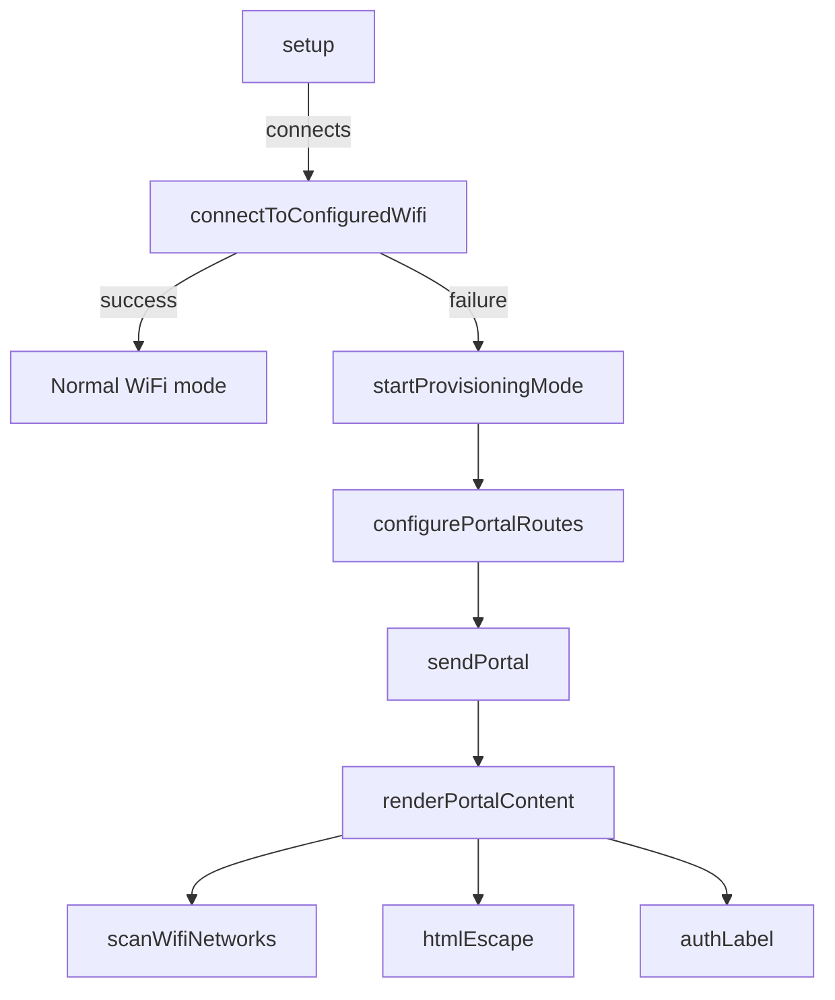

# Main Application

# Main Application Module Documentation

## Overview

The Main Application module is responsible for managing WiFi connectivity and providing a web-based user interface for configuring WiFi settings on an ESP32 device. It handles both the connection to a configured WiFi network and the provisioning of new credentials through a captive portal when no valid credentials are found.

## Key Components

### Constants

- **kApSsid**: The SSID of the access point created for provisioning.
- **kPreferencesNamespace**: The namespace used for storing WiFi credentials in the device's preferences.
- **kSsidKey** and **kPasswordKey**: Keys used to store and retrieve the SSID and password from preferences.
- **kWifiConnectTimeoutMs**: Timeout duration for connecting to a WiFi network.
- **kApIp**, **kApGateway**, **kApSubnet**: Configuration for the access point's IP address, gateway, and subnet mask.

### Structures

- **WifiNetwork**: A structure representing a WiFi network, containing:
  - `ssid`: The SSID of the network.
  - `rssi`: The Received Signal Strength Indicator.
  - `encryptionType`: The type of encryption used by the network.

### Global Variables

- **dnsServer**: An instance of `DNSServer` for handling DNS requests.
- **webServer**: An instance of `WebServer` for handling HTTP requests.
- **provisioningActive**: A boolean flag indicating whether the device is in provisioning mode.

## Functions

### `setup()`

The entry point for the application. It initializes the serial communication, attempts to connect to a configured WiFi network, and starts provisioning mode if no valid credentials are found.

### `loop()`

Handles the main application loop. If provisioning is active, it processes DNS requests and handles incoming HTTP client requests.

### WiFi Management Functions

- **`loadCredentials(String &ssid, String &password)`**: Loads saved WiFi credentials from preferences. Returns `true` if credentials are found, otherwise `false`.
  
- **`saveCredentials(const String &ssid, const String &password)`**: Saves the provided SSID and password to preferences. Returns `true` if the SSID was successfully saved.

- **`connectToConfiguredWifi()`**: Attempts to connect to the WiFi network using saved credentials. Returns `true` if connected, otherwise starts provisioning mode.

- **`scanWifiNetworks()`**: Scans for available WiFi networks and returns a vector of `WifiNetwork` structures containing unique SSIDs, RSSI values, and encryption types.

### Web Server Functions

- **`configurePortalRoutes()`**: Sets up the routes for the web server, including handling requests for saving credentials and rebooting the device.

- **`sendPortal(const String &message = "", const String &error = "", int statusCode = 200)`**: Sends the HTML content for the captive portal, including any messages or errors.

- **`renderPortalContent(const String &message = "", const String &error = "")`**: Generates the HTML content for the portal, including a form for entering WiFi credentials and a list of available networks.

- **`handleSaveCredentials()`**: Handles the POST request to save WiFi credentials. Validates the input and calls `saveCredentials()`.

- **`handleReboot()`**: Handles the request to reboot the device, sending a confirmation message before restarting.

### Utility Functions

- **`htmlEscape(const String &value)`**: Escapes HTML special characters in a string to prevent XSS attacks.

- **`authLabel(wifi_auth_mode_t encryptionType)`**: Returns a string representation of the encryption type (open or secured).

### Provisioning Functions

- **`startProvisioningMode()`**: Initializes the device in access point mode, starts the DNS server, and configures the web server for handling client requests.

## Execution Flow

The execution flow begins in the `setup()` function, which attempts to connect to a configured WiFi network. If the connection fails, it invokes `startProvisioningMode()`, which sets up the access point and web server. The web server listens for incoming requests, allowing users to save new WiFi credentials or reboot the device.

## Conclusion

The Main Application module provides a comprehensive solution for managing WiFi connectivity and user interaction through a web interface. It is designed to be easily extendable, allowing developers to add new features or modify existing functionality as needed. Understanding the flow of data and the role of each function is crucial for effective contributions to this module.