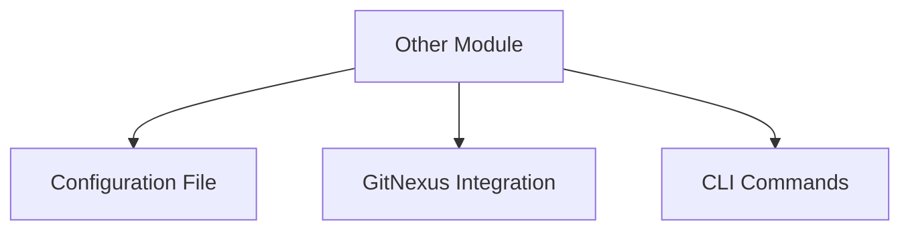

# Other

# Other Module Documentation

## Overview

The **Other** module serves as a placeholder for miscellaneous functionalities that do not fit into the primary categories of the codebase. It is designed to encapsulate utility functions, configurations, or any other components that may be required for the overall operation of the project but do not belong to a specific module.

## Purpose

The primary purpose of the Other module is to provide a flexible space for developers to add functionalities that are not directly related to the main features of the application. This can include helper functions, configuration settings, or any experimental code that may be useful for development or testing.

## Key Components

### Configuration File

The `platformio.ini` file is a critical component of the Other module. It defines the environment settings for the ESP32 development board, including:

- **Platform**: Specifies the platform as `espressif32`.
- **Board**: Indicates the board type as `esp32dev`.
- **Framework**: Uses the Arduino framework for development.
- **Library Dependencies**: Currently, there are no specific library dependencies defined, but this can be modified as needed.
- **Upload and Monitor Settings**: Configures upload speed and monitor speed for serial communication.

### GitNexus Integration

The Other module is integrated with GitNexus for code intelligence and impact analysis. This integration allows developers to:

- Assess the impact of changes before making modifications.
- Detect changes in the codebase to ensure that only expected symbols and execution flows are affected.
- Query execution flows and context for better understanding of the code.

### CLI Commands

The Other module leverages various CLI commands provided by GitNexus to facilitate development tasks. Key commands include:

- `gitnexus_impact({target: "symbolName", direction: "upstream"})`: Analyze the impact of changes on the codebase.
- `gitnexus_detect_changes()`: Verify that changes only affect expected symbols.
- `gitnexus_query({query: "concept"})`: Explore unfamiliar code by querying execution flows.

## Usage Guidelines

### Best Practices

- **Always perform impact analysis** before editing any symbol to understand the potential consequences of your changes.
- **Run `gitnexus_detect_changes()`** before committing to ensure that your changes are scoped correctly.
- **Avoid high-risk modifications** without proper analysis and understanding of the code.

### Common Tasks

| Task | Command |
|------|---------|
| Analyze impact of a change | `gitnexus_impact({target: "symbolName", direction: "upstream"})` |
| Check for changes before commit | `gitnexus_detect_changes()` |
| Query execution flows | `gitnexus_query({query: "concept"})` |

## Architecture

The Other module does not have a complex architecture, as it primarily serves as a utility space. However, it is essential to understand how it fits into the overall project structure.

## Conclusion

The Other module is a vital part of the codebase that allows for flexibility and experimentation. By following the guidelines and utilizing the tools provided, developers can effectively contribute to this module while maintaining the integrity of the overall project.