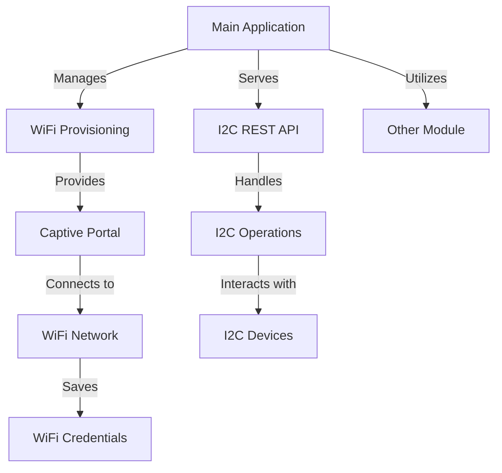

# wifi-i2c — Wiki

# wifi-i2c

Welcome to the **wifi-i2c** project! This repository contains firmware for an ESP32-based WiFi-to-I2C controller, designed to connect your I2C devices to a WiFi network seamlessly. The controller operates by exposing I2C master operations through a simple HTTP REST API, making it easy to interact with your devices over the network.

## What It Does

The **wifi-i2c** firmware provides the following key functionalities:

- **WiFi Connectivity**: Automatically connects to saved WiFi credentials on boot.
- **Fallback Access Point**: If WiFi credentials are missing or unreachable, it starts a local provisioning access point.
- **Captive Portal**: Users can select a nearby SSID, input their credentials, and reboot the device through a user-friendly interface.
- **I2C REST API**: After successfully connecting to WiFi, the firmware serves an API that supports I2C operations such as scan, write, read, and write-then-read transactions.

## Architecture Overview

The architecture of the **wifi-i2c** project is designed to facilitate easy interaction between the WiFi provisioning and I2C functionalities. The main components include the **Main Application** module, which manages the overall operation, and the **WiFi Provisioning** module, which handles the connection setup. The **Other** module provides additional utility functions as needed.

## Getting Started

To set up the **wifi-i2c** firmware, ensure you have the following:

- **Board Target**: ESP32 Dev Module (`esp32dev`)
- **Framework**: Arduino for ESP32
- **Build System**: PlatformIO

### Basic Setup Instructions

1. Clone the repository to your local machine.
2. Open the project in PlatformIO.
3. Configure your WiFi credentials in the appropriate section of the code.
4. Build and upload the firmware to your ESP32 device.

For detailed information on each module, you can explore the following:

- [WiFi Provisioning](wifi-provisioning.md): Learn how to set up and manage WiFi connections.
- [Main Application](main-application.md): Understand the core functionalities and operations of the application.
- [Other](other.md): Discover additional utility functions and configurations.

We hope you find this project useful and easy to work with. Happy coding!