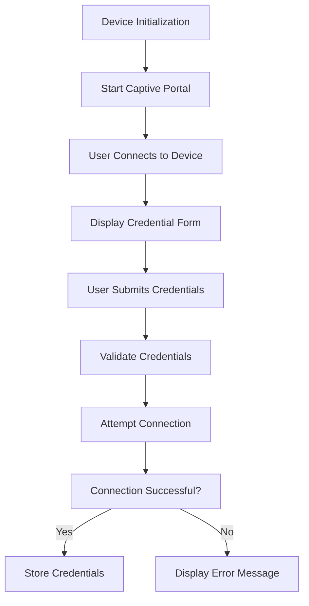

# WiFi Provisioning

# WiFi Provisioning Module

## Overview

The WiFi Provisioning module is designed to facilitate the connection of devices to WiFi networks through a captive portal. This module allows users to input their WiFi credentials in a user-friendly interface, enabling seamless connectivity for IoT devices and other network-enabled applications.

## Purpose

The primary purpose of the WiFi Provisioning module is to simplify the process of connecting devices to WiFi networks. It provides a captive portal that users can access to enter their network credentials, which are then securely transmitted to the device for configuration.

## Key Components

### 1. Captive Portal

The captive portal is the user interface that prompts users to enter their WiFi credentials. It is typically hosted on the device itself and is accessible via a web browser. The portal includes:

- **Input Fields**: For SSID and password entry.
- **Submit Button**: To send the credentials to the device.
- **Feedback Messages**: To inform users of successful or failed attempts to connect.

### 2. Credential Handling

Once the user submits their WiFi credentials, the module handles the following:

- **Validation**: Ensures that the SSID and password meet the required criteria (e.g., length, character set).
- **Storage**: Securely stores the credentials in the device's memory for future use.
- **Connection Attempt**: Initiates the connection process to the specified WiFi network.

### 3. Network Connection Logic

The module includes logic to manage the connection to the WiFi network. This involves:

- **Connecting**: Using the device's networking stack to attempt a connection with the provided credentials.
- **Error Handling**: Managing connection failures and providing feedback to the user through the captive portal.

## How It Works

1. **Device Initialization**: When the device starts, it enters a provisioning mode where it sets up the captive portal.
2. **User Interaction**: Users connect to the device's WiFi network and are redirected to the captive portal.
3. **Credential Submission**: Users enter their SSID and password, which are sent to the device upon submission.
4. **Connection Process**: The module validates the credentials, attempts to connect to the specified network, and provides feedback to the user.

## Integration with the Codebase

The WiFi Provisioning module interacts with the following components of the codebase:

- **Networking Stack**: Utilizes the device's networking capabilities to establish connections.
- **User Interface Framework**: Integrates with the UI framework to render the captive portal and handle user input.
- **Configuration Management**: Works with the configuration management system to store and retrieve WiFi credentials.

### Execution Flow

Although there are no explicit execution flows detected for this module, the general flow can be summarized as follows:

## Conclusion

The WiFi Provisioning module is a critical component for enabling easy and secure connectivity for devices. By providing a user-friendly captive portal and robust credential handling, it ensures that users can quickly connect their devices to WiFi networks with minimal hassle. Developers contributing to this module should focus on enhancing the user experience, improving validation mechanisms, and ensuring secure storage of credentials.